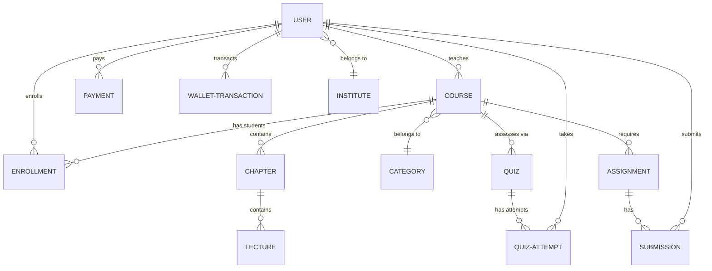

# Learning Management System (LMS) - Entity Relationship Diagram (ERD)

This document provides a detailed breakdown of the database entities and their relationships for the LMS platform.

## 1. Core Entities

### **User**
Manages all participants (Students, Instructors, Admins).
- `userId` (Primary Key)
- `name`: Full name of the user.
- `email`: Unique login identifier.
- `password`: Hashed credentials.
- `role`: Enum (student, instructor, admin, staff).
- `walletBalance`: Current funds for course purchases or instructor earnings.
- `isApproved`: Boolean flag for instructor verification.
- `institute`: Reference to the educational institute.

### **Course**
The primary product offered on the platform.
- `courseId` (Primary Key)
- `courseTitle`: Heading of the course.
- `courseDescription`: Detailed information.
- `coursePrice`: Base cost.
- `level`: Enum (Beginner, Intermediate, Advanced).
- `instructor`: User reference (Instructor role).
- `category`: Classification reference.
- `isPublished`: Visibility status.

### **Enrollment**
The link between a Student and a Course.
- `enrollmentId` (Primary Key)
- `userId`: Reference to the Student.
- `courseId`: Reference to the Course.
- `progress`: Percentage of completion.
- `completedLessons`: List of finished lectures.
- `status`: Enum (active, refunded, suspended).

### **Quiz**
Assessment linked to a specific course.
- `quizId` (Primary Key)
- `courseId`: Reference to the parent course.
- `title`: Name of the quiz.
- `passingScore`: Minimum threshold to pass.
- `questions`: Array of question objects (text, options, correct answer).

### **Assignment**
Manual tasks for student evaluation.
- `assignmentId` (Primary Key)
- `courseId`: Reference to the course.
- `title`: Task name.
- `deadline`: Due date for submission.

---

## 2. Relationships

| Entity A | Relationship | Entity B | Description |
| :--- | :--- | :--- | :--- |
| **User** | 1 : N | **Course** | An instructor can create multiple courses. |
| **User** | 1 : N | **Enrollment** | A student can have multiple enrollments. |
| **Course** | 1 : N | **Enrollment** | A course can have many students enrolled. |
| **Course** | 1 : N | **Quiz** | A course can contain multiple assessments. |
| **Course** | 1 : N | **Chapter/Lecture** | A course is structured into many content pieces. |
| **User** | 1 : N | **WalletTransaction** | A user tracks their financial history. |

---

## 3. ERD Diagram (Mermaid)

You can view this diagram in any Markdown viewer that supports Mermaid (like VS Code, GitHub, or [Mermaid Live](https://mermaid.live/)).

---

## 4. How to Use This File
1. **Visualizing**: Copy the Mermaid code above into the [Mermaid Live Editor](https://mermaid.live/) to generate a high-quality Image/PDF.
2. **Documentation**: Keep this file in your project root for team onboarding and database architecture reference.
